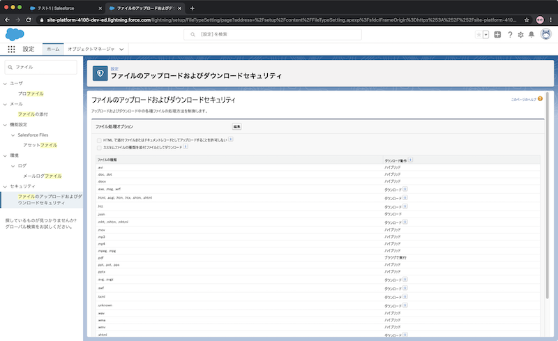

# 添付ファイル画像ビュアー
Salesforce Lightning Platform のレコード詳細画面で使うことを想定した、レコードへの添付ファイルを画面に表示する Lightning Web Component です。


## 注意
このコンポーネント、およびソースコードは実装サンプル・例として共有するものです。(改変自由) 動作を保証・サポートするものではありませんので、あらかじめご了承ください。
## インストール
sfdx が使えるようになっている必要があります。インストール、設定方法などは次を参照してください。[Trailhead : Salesforce DX の設定](https://trailhead.salesforce.com/ja/content/learn/modules/sfdx_app_dev/sfdx_app_dev_setup_dx)
デフォルトの DevHub も設定された状態で次のコマンドを実行します。

1. ダウンロード
```
% git clone https://github.com/hinabasfdc/AttachedFileViewer.git
% cd AttachedFileViewer
```
2. スクラッチ組織の作成
```
sfdx force:org:create -s -f config/project-scratch-def.json -a AttachedFileViewerTest01
```
3. ソースの入れ込み
```
sfdx force:source:push
```
4. スクラッチ組織にログイン
```
sfdx force:org:open
```

## 設定
1. PDF ファイルを表示させる場合の組織の設定変更

添付ファイルが PDF の場合は、iframe を使って表示させているので、組織の設定変更が必要になります。(設定しない場合はファイルがダウンロードされます)


2. 画面への配置

レコード詳細の編集ページで、“添付ファイルビュアー”を使いたい場所にドラッグアンドドロップしてください。



* 設定パラメータ
  * heightIframe
    * 整数
    * PDF ファイルを表示させる時の枠の高さを指定します。PDF 以外は自動調整されるので影響しません

## 現時点の仕様
表示できるのは次の種類です。
* JPG, PNG
* PDF
* WORD / EXCEL / POWERPOINT (最初の1ページのみ。一度標準のプレビュー表示を行わないと表示されない場合あり)